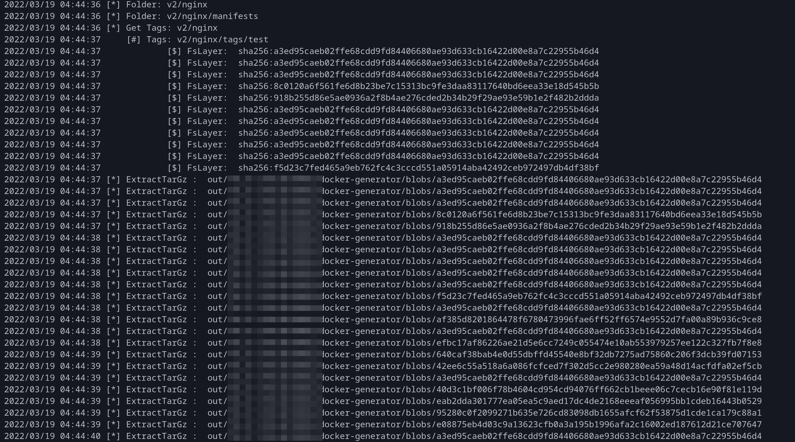

# nexus hacker

nexus docker repository downloader


## 使用

```bash
❯ go run main.go -h
Usage of /tmp/go-build1781663169/b001/exe/main:
  -host string
    	1.1.1.1:8080
  -latest
    	only download latest (default false)
  -registry string
    	xx-registry
  -thread int
    	20 (default 20)

./nexus -host http://127.0.0.1:8080 -registry repo-name  -latest
```

## 运行逻辑

在渗透中经常能遇到nexus，但是一般他docker的接口都需要认证

但是通过webui可以直接浏览和下载docker的fslayer

运用逻辑非常简单

首先遍历指定的repo,获取所有的image和对应的blobsum,然后在批量下载所有的blob

再通过之前image对应的blobsum把已经下载的blob进行解压


## 执行



## 结果


## 备注

该程序使用了我一个私有库`Goal`，因其中硬编码了较多key，所以暂时无法开源,

导致该程序无法直接编译，编译好的可以可以在releases中下载

如果有需要二次开发需求可以把所有`Ghttp`相关的方法进行重新实现然后编译。